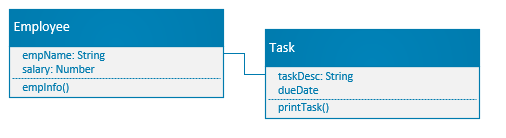

# Tutorial 6: Constructor Functions & Class Notation

In this tutorial, you are going to practice working with constructor functions and class notations to recreate a script written using plain objects, to implement the design shown in the image below.

While the class notation provides a better organization of the code, the constructor function provides a good enough mechanism to resemble the class creation and object instantiation concepts of the object-oriented paradigm so that we can benefit from the object-oriented design principles and patterns that are widely accepted as solutions for common problems.

You're going to learn more about OOD principles & patterns in other courses; however, just to establish the connection, take the ability to use the UML class diagram below as one of the benefits that the object-oriented paradigm provides.

As you can see in the diagram, we have two concepts, 'Employee' and  'Task'; each of them has methods and attributes/ properties. The file named 'plainObjects.js' implements the given design using plain objects. As you can see, it's not the best way to organize the code; for example, the functions are defined separately with certain objects in mind, and there is duplication in using creating similar properties, which could be error-prone. 

## Task 1: Using Constructor Functions

In the file 'constructorFunctions.js', create two constructor functions for the two concepts 'Employee' and 'Task' and re-organize the code in plainObjects.js so that the objects are created using the constructor functions and the script prints the same output of plainObject.js

## Task 2: Using the Class Notation

In the file named 'classNotation.js' re-organize the code again to use the class notation and give the same output.

### Rubric (Total 6 Points)

| Criteria                           | Points | Description |
|------------------------------------|--------|-------------|
| **Code Organization & Use of Constructor Functions (2 points)** | 0-2    | - **0 points**: Constructor function version not implemented or non-functional. - **1 point**: Partially implemented constructor version, but has major issues (e.g., incorrect constructors or UML design not followed). - **2 points**: Correctly implemented constructor version, all objects are properly created using constructors, and the output matches the original code. |
| **Implementation of Class Notation (2 points)** | 0-2    | - **0 points**: Class notation version not implemented or non-functional. - **1 point**: Partially implemented class version, but has major issues (e.g., UML design not followed, incorrect methods). - **2 points**: Correctly implemented class version, all functionality is achieved using class notation, and the output matches the original code. |
| **Code Clarity & Comments (1 point)** | 0-1    | - **0 points**: Code lacks clarity, is hard to understand, and lacks appropriate comments. - **1 point**: Code is well-organized, structured, and has appropriate comments explaining key parts. |
| **Maintaining Same Output (1 point)** | 0-1    | - **0 points**: Output does not match the original `plainObjects.js` version. - **1 point**: Output matches the original `plainObjects.js` version. |
